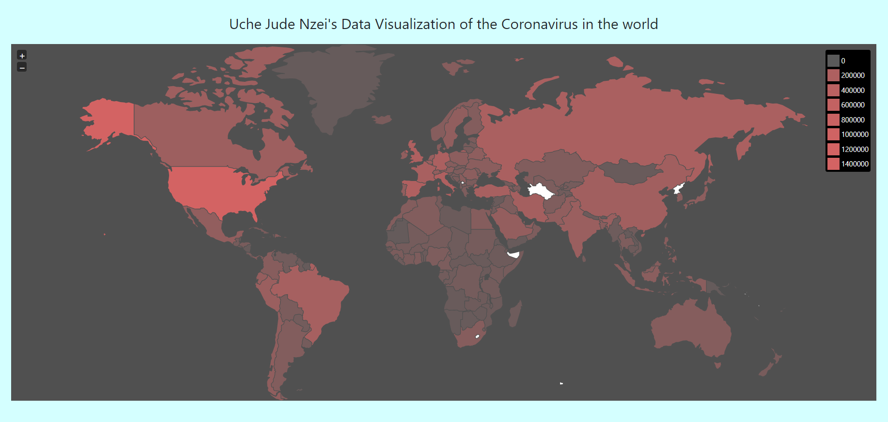
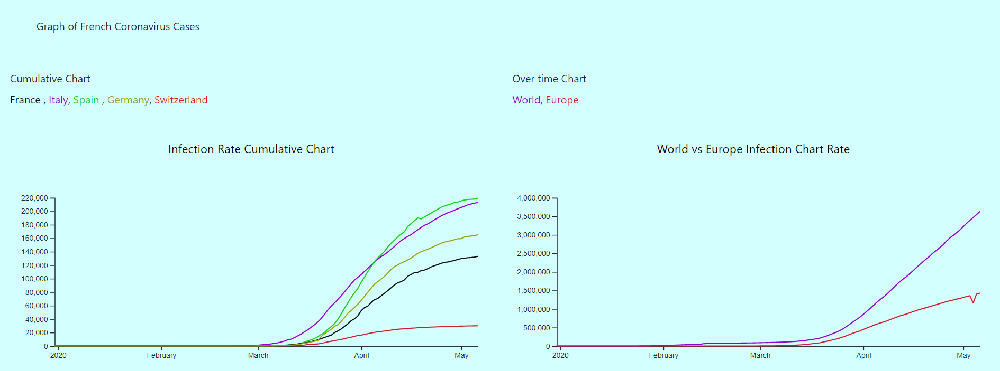
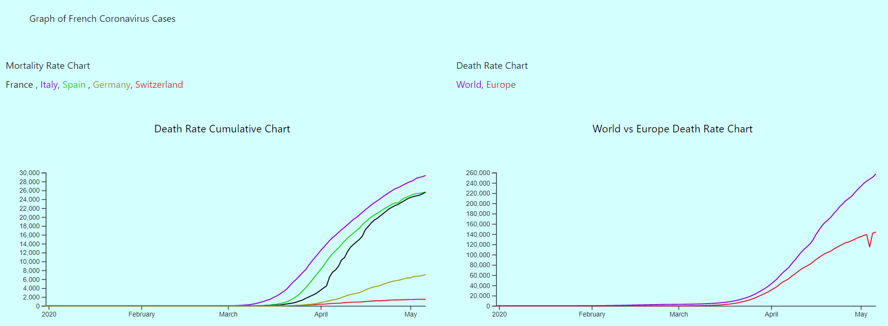

# Covid19 Data Visualization
A data visualisation project using a JavaScript to visualise the COVID-19 impact in the world dated up until the first week of May 2020. The project shows the various statistics across different countries of the world are visualized in a map as well as graphs comparing the impacts in some european countries.

This project was designed using the D3 and J-VectorMap JavaScript libraries.

Screenshots of the visualzations are shown below:

* World Map

* Infection Rate

* Death Rate

The link to the D3 library can be found [here](https://d3js.org/)

The link to the J-VectorMap library can be found [here](https://jvectormap.com/)